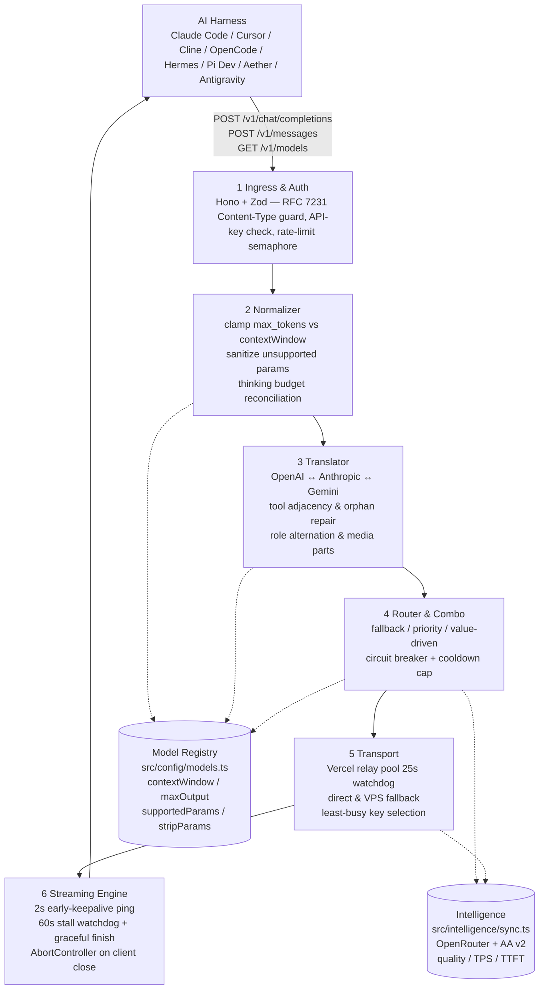

# Architecture — lmntea-router

> **Scope:** Public, 1-page overview for contributors **without** `devdocs/` access.
> Private deep dives live in `devdocs/01-ARCHITECTURE.md` (gitignored). This file must stay consistent with that source — same module tree, same 7 phases, same stack.

**Stack (decided):** `TypeScript 5.6 + Hono 4.x + Bun 1.2 (Node 20 fallback) + Vitest 2.x + Zod 3.x + tsup + tsx`

---

## Request Pipeline

**Happy path (8 steps):** `harness request → Ingress validates & authenticates → Normalizer clamps/sanitizes → Translator converts wire format → Router picks combo candidate → Transport dispatches via relay/direct → Streaming wraps with keepalive + watchdog → clean SSE / JSON back to harness`.

Error path: `400` → immediate reject (no retry, no cooldown). `401/403/429` → rotate key in pool, retry. `5xx/504/timeout` → failover to next combo candidate; 3 consecutive 5xx in 60 s trips circuit breaker (cooldown 60 s, cap 300 s).

---

## Module Map

Canonical tree — authoritative in every doc and in code:

| Module | Path | Responsibility | Key Exports |
|---|---|---|---|
| **Entry** | `src/index.ts` | Hono app, route wiring, `GET /health` | `app`, `start()` |
| **Model Registry** | `src/config/models.ts` | Declarative per-model caps (`contextWindow`, `maxOutputTokens`, `stripParams`, `requiresThinkingReconciliation`) | `MODEL_REGISTRY`, `ModelSpec` |
| **Provider Registry** | `src/config/providers.ts` | Upstream base URLs, key pools, relay pool, `isPrivateHostname` SSRF guard | `PROVIDER_REGISTRY`, `RELAY_POOL` |
| **Intelligence Sync** | `src/intelligence/sync.ts` | Background sync from OpenRouter (`/api/v1/models`) + Artificial Analysis v2 | `syncModels()`, `UnifiedModelSpec` |
| **Intelligence Scoring** | `src/intelligence/scoring.ts` | Value score = quality/price, tier recommendation | `scoreModel()`, `rankByValue()` |
| **Clamp** | `src/normalizer/clamp.ts` | `availableOutput = contextWindow - inputTokens - 256`; `max_tokens = min(client_max, model.maxOutput, availableOutput)` | `clampMaxTokens()` |
| **Sanitize** | `src/normalizer/sanitize.ts` | Strip unsupported sampling params per `supportedParams` (e.g. drop `temperature` on o1/DeepSeek) | `sanitizeParams()` |
| **Thinking** | `src/normalizer/thinking.ts` | Reconcile `max_tokens > thinking.budget_tokens + 1024`; map `reasoning_effort` ↔ budget table | `normalizeThinking()` |
| **OAI → Claude** | `src/translator/openai-to-claude.ts` | System hoist, `cache_control` breakpoints, role alternation, message shape conversion | `openaiToClaude()` |
| **OAI → Gemini** | `src/translator/openai-to-gemini.ts` | `systemInstruction`, `contents`/`parts`, `thought`/`thoughtSignature`, consecutive-role merge | `openaiToGemini()` |
| **Tools** | `src/translator/tools.ts` | `enforceToolResultAdjacency`, orphan → user-text fallback, missing-tool fill | `repairToolAdjacency()` |
| **Early Keepalive** | `src/streaming/earlyKeepalive.ts` | If no header/chunk in 2 s, flush `200 text/event-stream` + `: keepalive\\n\\n` every 3 s until real data | `withEarlyKeepalive()` |
| **Stall Watchdog** | `src/streaming/stallWatchdog.ts` | 60 s reset-on-chunk timer; on stall emits synthesized `finish_reason: stop` / `message_delta` + `[DONE]` | `StallWatchdog` |
| **Combo** | `src/router/combo.ts` | `fallback` / `priority` / `value-driven` strategies, least-busy selection | `routeCombo()` |
| **Circuit Breaker** | `src/router/circuitBreaker.ts` | Error classifier, sliding-window `AllowedFails` (60 s), cooldown with 300 s cap | `classifyError()`, `shouldTrip()` |
| **Transport** | `src/router/transport.ts` | Relay vs direct selection, `RELAY_TIMEOUT_MS = 25_000`, header sanitization, `x-relay-auth` | `dispatch()`, `proxyFetch()` |

---

## Data Flow & Invariants

1. **No silent param drop outside `normalizer/`** — every mutation is registry-driven and tested.
2. **Translators are pure functions** — deterministic, unit-testable without I/O (`app.request()` in Vitest for integration).
3. **Streaming never swallows errors** — mid-stream failures serialize as SSE error events + `[DONE]`, not thrown exceptions.
4. **Relay pool is authenticated** — `x-relay-auth` + `isPrivateHostname` blocks RFC 1918 / loopback / `169.254.169.254` (SSRF) on every deploy.
5. **Vercel relays are bounded** — 25 s TTFT watchdog; on timeout failover to direct/VPS before Vercel's 60 s `FUNCTION_INVOCATION_TIMEOUT`.
6. **Intelligence is advisory, never blocking** — if OpenRouter/AA sync fails, router falls back to the static `MODEL_REGISTRY`.

---

## Phases (P0–P6)

Same 7 phases in `devdocs/02-ROADMAP.md`:

| Phase | Name | Delivers |
|---|---|---|
| **P0** | Bootstrap & Tooling | TS+Hono+Bun+Vite+Zod+tsup/tsx, lint, CI — the ADR in `devdocs/00-TECH-STACK.md` |
| **P1** | Ingress & Auth | Hono routes, Zod ingress schemas, key auth, byte-bounded admission queue |
| **P2** | Normalizer & Registry | `config/models.ts`, `clamp.ts`, `sanitize.ts`, `thinking.ts` |
| **P3** | Translator | `openai-to-claude.ts`, `openai-to-gemini.ts`, `tools.ts` — adjacency, role merge, media parts |
| **P4** | Streaming Engine | `earlyKeepalive.ts`, `stallWatchdog.ts`, SSE writer, abort propagation |
| **P5** | Router & Relay | `combo.ts`, `circuitBreaker.ts`, `transport.ts` — relay pool, 25 s bound, least-busy |
| **P6** | Intelligence & Polish | `intelligence/sync.ts`, `scoring.ts`, `GET /v1/models` enrichment, hardening |

> **Next step for contributors:** clone and follow `devdocs/SETUP.md` (<5 min). For the private deep dive: `devdocs/01-ARCHITECTURE.md` (topology, ADRs, failure taxonomy). For contracts: `devdocs/03-API-CONTRACTS.md`. For verification: `devdocs/04-TESTING.md`.

---

## Further Reading (public)

- `docs/README.md` — landing page, quick start, `curl` examples.
- `devdocs/SETUP.md` — contributor setup (prereqs, env, where to add a provider).
- Private (repo access only, gitignored): `devdocs/` + `research/` + `reference/` — see `devdocs/README.md` for the indexed map.
