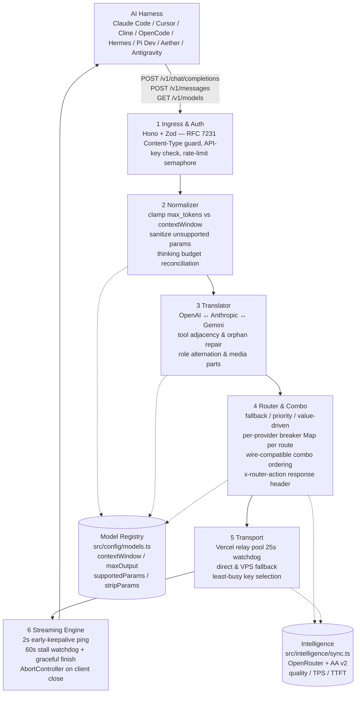

# Architecture — lmntea-router

> **Scope:** Public, 1-page overview for contributors **without** `devdocs/` access.
> Private deep dives live in `devdocs/01-ARCHITECTURE.md` (gitignored). This file must stay consistent with that source — same module tree, same 7 phases, same stack.

**Stack (decided):** `TypeScript 5.9 + Hono 4.13 + Bun 1.4 (Node >=20) + Vitest 2.x + Zod 3.25 + tsup + tsx`

---

## Request Pipeline



**Happy path (8 steps):** `harness request → Ingress validates & authenticates → Normalizer clamps/sanitizes → Translator converts wire format → Router picks combo candidate → Transport dispatches via relay/direct → Streaming wraps with keepalive + watchdog → clean SSE / JSON back to harness`.

Error path (`classifyError` in `src/router/circuitBreaker.ts`): `400` → `REJECT_IMMEDIATE` (no retry, no cooldown). `401/403/429` → rotate key in pool, retry. `408`/`5xx`/timeout/network → failover to the next combo candidate. The router stage is **wired** in every route (`chat.ts`, `messages.ts`): each holds a per-provider `Map<string, BreakerState>` — 3 failures inside a 60 s sliding window trip the breaker; cooldown escalates `60 s → 120 s → 240 s → 300 s cap`, re-arms after each elapsed cooldown, and any success clears the failure window (`recordSuccess`). Candidate order comes from `buildUpstreamCandidates` (healthy-first via live breaker states, wire-compatible providers hosting the same slug), and every routing decision is surfaced to the caller through the `x-router-action` response header.

---

## Module Map

| Module | Path | Responsibility | Key Exports |
|---|---|---|---|
| **Entry** | `src/index.ts` | Hono app, route wiring, `GET /health` | `app`, `start()` |
| **Routes** | `src/routes/chat.ts`, `messages.ts`, `models.ts`, `usage.ts` | Hono handlers — Zod parse → normalizer → dispatch → streaming (usage: period validation → summary) | `mountChat`, `mountMessages`, `mountModels`, `mountUsage` |
| **Middleware** | `src/middleware/auth.ts`, `bodyLimit.ts`, `contentType.ts`, `requestId.ts`, `usage.ts` | 415 guard, 413 body limit (1 MB), 401 auth, request-id propagation, post-response usage recording | `authMiddleware`, `bodyLimitMiddleware`, `usageMiddleware` |
| **Schemas** | `src/schemas/chat.ts`, `messages.ts`, `usage.ts` | Ingress Zod schemas (max_tokens bounds, tool shapes, usage period query) | `ChatCompletionRequestSchema`, `UsageQuerySchema` |
| **Model Registry** | `src/config/models.ts` | Declarative per-model caps (`contextWindow`, `maxOutputTokens`, `stripParams`, `requiresThinkingReconciliation`) | `MODEL_REGISTRY`, `ModelSpec` |
| **Provider Registry** | `src/config/providers.ts` | Upstream base URLs, key env mapping, relay flag | `PROVIDERS`, `getProviderForModel` |
| **Intelligence Sync** | `src/intelligence/sync.ts` | Background sync from OpenRouter (`/api/v1/models`) + Artificial Analysis v2 — started at the serve entry point (guarded in tests), 6 h interval, never blocks startup. Snapshot is advisory: `getModelSpec` falls back to the synced snapshot for unknown ids (OpenRouter passthrough), but the static registry stays authoritative in `/v1/models` precedence | `syncModels()`, `startIntelligenceSync()` |
| **Clamp** | `src/normalizer/clamp.ts` | `availableOutput = contextWindow - inputTokens - 256`; `max_tokens = min(client_max, model.maxOutput, availableOutput)` | `clampMaxTokens()` |
| **Sanitize** | `src/normalizer/sanitize.ts` | Strip unsupported sampling params per `stripParams` (e.g. drop `temperature` on reasoning models) | `sanitizeParams()` |
| **Thinking** | `src/normalizer/thinking.ts` | Reconcile `max_tokens > thinking.budget_tokens + 1024`; map `reasoning_effort` ↔ budget table | `normalizeThinking()` |
| **OAI → Claude** | `src/translator/openai-to-claude.ts` | System hoist, `cache_control` breakpoints, role alternation, message shape conversion | `openaiToClaude()` |
| **OAI → Gemini** | `src/translator/openai-to-gemini.ts` | `systemInstruction`, `contents`/`parts`, `thought`/`thoughtSignature`, consecutive-role merge | `openaiToGemini()` |
| **Tools** | `src/translator/tools.ts` | `enforceToolResultAdjacency`, orphan → user-text fallback, missing-tool fill | `repairToolAdjacency()` |
| **SSE** | `src/streaming/sse.ts` | SSE formatters, `text/event-stream` headers, stall synthesis (`finish_reason: stop`) | `formatData`, `sseHeaders`, `createMockSSEStream` |
| **Early Keepalive** | `src/streaming/earlyKeepalive.ts` | If no header/chunk in 2 s, flush `200 text/event-stream` + `: keepalive\n\n` every 3 s until real data | `withEarlyKeepalive()` |
| **Stall Watchdog** | `src/streaming/stallWatchdog.ts` | 60 s reset-on-chunk timer; on stall emits synthesized `finish_reason: stop` / `message_delta` + `[DONE]` | `StallWatchdog` |
| **Combo** | `src/router/combo.ts` | `fallback` / `priority` / `value-driven` strategies, least-busy selection, healthy-first ordering via live breaker states | `routeCombo()` |
| **Candidates** | `src/router/candidates.ts` | Shared upstream-candidate resolution for both routes — primary provider URL, wire-compatible alternates hosting the same slug, per-provider `allowPrivate` threading | `buildUpstreamCandidates()`, `routerActionHeaders()` |
| **Transport** | `src/router/transport.ts` | Relay vs direct selection, `RELAY_TIMEOUT_MS = 25_000`, header sanitization, `x-relay-auth` | `dispatch()`, `proxyFetch()` |
| **Usage** | `src/observability/usage.ts` | Bounded process-local request recorder (10k ring, restart clears) + period/model summaries; gateway latency only, token/cost fields null until upstream supplies them | `recordUsage`, `summarizeUsage` |
---

## Data Flow & Invariants

1. **No silent param drop outside `normalizer/`** — every mutation is registry-driven and tested.
2. **Translators are pure functions** — deterministic, unit-testable without I/O (`app.request()` in Vitest for integration).
3. **Streaming never swallows errors** — mid-stream failures serialize as SSE error events + `[DONE]`, not thrown exceptions.
4. **Relay pool is authenticated** — `x-relay-auth` + `isPrivateHostname` blocks RFC 1918 / loopback / `169.254.169.254` (SSRF) on every deploy.
5. **Vercel relays are bounded** — 25 s TTFT watchdog; on timeout failover to direct/VPS before Vercel's 60 s `FUNCTION_INVOCATION_TIMEOUT`.
6. **Intelligence is advisory, never blocking** — if OpenRouter/AA sync fails, router falls back to the static `MODEL_REGISTRY`.

---

## Phases (P0–P6)

Same 7 phases in `devdocs/02-ROADMAP.md`:

| Phase | Name | Delivers |
|---|---|---|
| **P0** | Bootstrap & Tooling | TS+Hono+Bun+Vite+Zod+tsup/tsx, lint, CI — the ADR in `devdocs/00-TECH-STACK.md` |
| **P1** | Ingress & Auth | Hono routes, Zod ingress schemas, key auth, byte-bounded admission queue |
| **P2** | Normalizer & Registry | `config/models.ts`, `clamp.ts`, `sanitize.ts`, `thinking.ts` |
| **P3** | Translator | `openai-to-claude.ts`, `openai-to-gemini.ts`, `tools.ts` — adjacency, role merge, media parts |
| **P4** | Streaming Engine | `earlyKeepalive.ts`, `stallWatchdog.ts`, SSE writer, abort propagation |
| **P5** | Router & Relay | `combo.ts`, `circuitBreaker.ts`, `transport.ts` — relay pool, 25 s bound, least-busy |
| **P6** | Intelligence & Polish | `intelligence/sync.ts`, `scoring.ts`, `GET /v1/models` enrichment, hardening |

> **Next step for contributors:** clone and follow [`docs/SETUP.md`](./SETUP.md) (<5 min). For the private deep dive: `devdocs/01-ARCHITECTURE.md` (topology, ADRs, failure taxonomy). For contracts: `devdocs/03-API-CONTRACTS.md`. For verification: `devdocs/04-TESTING.md`.

## Build & Verification

```bash
pnpm build        # tsup → dist/index.js ~190 KB (+ sourcemap + d.ts)
pnpm typecheck    # tsc --noEmit — clean on main
env -u AUTH_TOKENS pnpm test   # 43 files, 588 tests — hermetic app.request()

```

`tsup.config.ts`: `entry: ['src/index.ts']`, `format: ['esm']`, `dts: true`, `sourcemap: true`, `splitting: false`, `target: es2022`.

---

## Further Reading (public)

- `docs/README.md` — landing page, quick start, `curl` examples (stream + non-stream).
- [`docs/SETUP.md`](./SETUP.md) — contributor setup (prereqs, env table, run & test, provider checklist).
- Private (repo access only, gitignored): `devdocs/` + `research/` + `reference/` — see `devdocs/README.md` for the indexed map.
