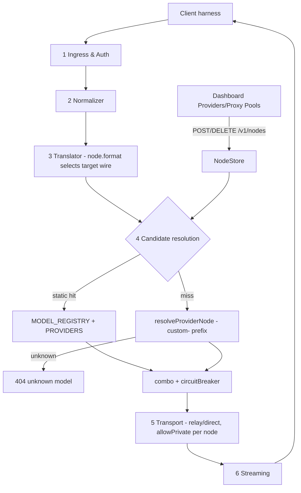

# Provider Nodes — Integration Wireframe

> Goal: adopt **9router's architecture** (config-driven registry, translator matrix, executor seams) with **freellmapi's concept** (user-defined upstream endpoints, key-attached routing, honest failure taxonomy) inside lmntea-router's 17-file pipeline core — without breaking any repo invariant.
>
> Sources: `reference/9router` (9router-app v0.5.55), `reference/freellmapi` (@freellmapi/server 0.2.1), `reference/OmniRoute` (omniroute v3.8.50). Claims verified by read-only scouts; every mapping cites real files.

---

## 1. What "node" means in each repo

| Node kind | 9router | OmniRoute | freellmapi | lmntea-router today |
|---|---|---|---|---|
| **Builtin provider** | one file per provider: `open-sse/providers/registry/{id}.js` (`RegistryEntry`, template `REGISTRY_TEMPLATE.js`; ~120 auto-folded into `PROVIDERS`/`PROVIDER_MODELS` by `open-sse/providers/index.js`) | `REGISTRY` const map `open-sse/config/providers/index.ts` (~260 via factory fns; `RegistryEntry` in `shared.ts`) | `providers/index.ts` `Map<Platform, BaseProvider>` + `register()` (~40, mostly `OpenAICompatProvider`) | `src/config/providers.ts` `PROVIDERS` (35 `ProviderSpec`) |
| **Model catalog** | co-located `entry.models[]`; caps/pricing in fallback chains (`providers/capabilities.js`, `providers/pricing.js`, models.dev source) | nested `RegistryModel[]` (contextLength/maxOutput/strip/thinkingEfforts) | DB rows `models` UNIQUE(platform, model_id) + signed `catalog-sync` | separate `MODEL_REGISTRY` (122 `ModelSpec`) + intelligence sync — keep |
| **User-defined custom endpoint (the node)** | virtual prefix `openai-compatible-*` / `anthropic-compatible-*` created on the fly (`executors/base.js` prefix branch; `src/lib/db/repos/nodesRepo.js`) | **`provider_nodes`** SQLite table (`src/lib/db/providers/nodes.ts` `createProviderNode`: id/prefix/api_type/base_url/chat_path/custom_headers_json); `buildReservedPrefixes()` blocks shadowing | no table — `resolveProvider('custom', baseUrl)` builds a per-key `OpenAICompatProvider` from the `api_keys` row | **missing — this wireframe adds it** |
| **Keyless / free upstreams** | `noAuth` + virtual "noauth" connection (token `public`), optional rotating proxy pool | — | `keyless` flag (AIHorde, Pollinations) | static specs only |
| **OAuth upstreams** | `oauth{clientId,tokenUrl,refresh}` block + `tokenRefresh.js` | `RegistryOAuth` + `tokenRefresh.ts` | dedicated provider classes | none — out of scope |
| **Key pools / rotation** | SQLite `providerConnections`, priority + per-model locks (`accountFallback.js modelLock_`) | `extraApiKeys[]` round-robin + `KeyHealth` (fail×2 → invalid; `apiKeyRotator.ts`) | `api_keys` rows, AES-256-GCM (`lib/crypto.ts`), leases + sliding windows + 429 cooldown learning (`services/ratelimit.ts`) | env `apiKeyEnv` per spec; breaker does provider-level cooldown |
| **Fallback engine** | `chatCore.js` loop: translate → token savers → `getExecutor().execute()` → refresh-retry | `handleChat` (2338 lines) → `executeChatWithBreaker` → executor | **`runFallbackLoop(FallbackHooks)`** `lib/fallback-loop.ts` — one loop shared by all 3 wire surfaces; route()/dispatch() hooks; 20 attempts / 45 s budget; honest 503/429/413 exhaustion | `routeCombo` + `circuitBreaker` + `transport.dispatch` — equivalent shape, keep |
| **Wire translation** | translator Map keyed `"from:to"`, direct route else OpenAI pivot (`open-sse/translator/index.js`, 13 formats) | same pattern (`translator/registry.ts`) | per-provider adapter classes normalize in-adapter | `openai-to-claude.ts` / `openai-to-gemini.ts` — keep, add per-node `format` field |
| **Usage/analytics** | db usage repos | requests table | `requests` + `request_hourly` + lifetime totals in one tx (`lib/request-log.ts`) | usage slice landed (`observability/usage.ts`) — parity already |

**The gap is one row**: user-defined custom endpoints (nodes). Everything else lmntea-router already has, in a stricter registry-first form.

---

## 2. ProviderNode — the shape (union of the three, reduced to our constraints)

```
ProviderNode {
  id: string                 // "custom-<slug>" — must NOT collide with provider ids/aliases
  format: 'openai' | 'anthropic' | 'gemini'   // wire dialect (9router transport.format)
  baseUrl: string            // e.g. http://127.0.0.1:11434/v1
  chatPath?: string          // default per format: /chat/completions | /messages | :generateContent
  modelsPath?: string        // for /v1/models passthrough + node model discovery
  headers?: Record<string,string>          // static extra headers
  auth?: { header?: string; scheme?: 'bearer'|'x-api-key'; source: 'env'|'inline'; keyEnv?: string; key?: string }  // preferred: source 'env' + keyEnv (no secret at rest). 'inline' only for dashboard convenience: key lives in gitignored nodes.json, NEVER echoed by GET /v1/nodes (redacted to set/unset)
  keyless?: boolean          // 9router noAuth / freellmapi keyless
  models?: Array<{ id: string; contextWindow?: number; maxOutputTokens?: number }>  // omit → discover via modelsPath
  timeoutMs?: number         // default 25_000 (RELAY_TIMEOUT_MS parity)
  allowPrivate?: boolean     // loopback opt-in — reuses existing transport SSRF semantics
  enabled?: boolean
}
```

Invariants honored:
- **No new runtime deps.** Node storage Phase 1 = process-local + JSON file (`config/nodes.json`, gitignored); Phase 2 optional persistence via `node:sqlite` / `bun:sqlite` (built-ins). No Express/SQLite port.
- **Registry-first stands.** Static `MODEL_REGISTRY`/`PROVIDERS` always win; a node may never shadow a builtin id or provider alias — OmniRoute's `buildReservedPrefixes()` rule (`src/lib/providerNodePrefixes.ts`).
- **SSRF unchanged.** `isPrivateHostname` guard applies to node baseUrl; `allowPrivate` is the existing explicit opt-in (loopback local models like Ollama).
- **Honesty unchanged.** Unknown model caps → `—` / clamp via syncedSnapshot fallback, never invented.

## 3. Request flow with nodes (wireframe)



Candidate resolution extension (single seam, `src/router/candidates.ts`):
`buildUpstreamCandidates(model)` → static lookup first (unchanged) → else `resolveNodeForModel(model)` strips the `custom-<slug>/model-id` prefix and returns one candidate `{ url: baseUrl + chatPath, format, headers, allowPrivate, provider: node.id }` → combo/breaker/transport treat it exactly like a builtin (per-provider breaker key = node id).

## 4. File-level plan

```
src/
├── config/nodes.ts          # ProviderNode type, RESERVED_PREFIXES, NodeStore: load(file) / validate / resolveNodeForModel
├── schemas/nodes.ts         # Zod NodeSchema — same validation for file load + admin POST
├── routes/nodes.ts          # GET/POST/DELETE /v1/nodes (behind existing auth middleware; admin)
└── router/candidates.ts     # + resolveNodeForModel fallback after static miss (existing exports untouched)
tests/nodes.test.ts          # hermetic: collision reject, SSRF reject without allowPrivate, format routing, clamp via models[]
apps/web/src/pages/Providers.tsx   # section: Custom nodes (read from GET /v1/nodes; no mock)
apps/web/src/pages/ProxyPools.tsx  # node CRUD form (baseUrl/format/auth env hint/allowPrivate toggle)
```

Dashboard wireframe (Providers page, instrument-console tokens):

```
PROVIDERS ────────────────────────────────────────── 35 builtin · 2 nodes
[ Builtin catalog ]  static registry · sourced from PROVIDERS
  id           baseUrl tier    models
  opencode     https…  relay   3
  …
[ Custom nodes ]  process-local · restart clears · no shadowing
  + Add node
  id custom-ollama   format openai   baseUrl http://127.0.0.1:11434/v1   ● live(200)   [delete]
  id custom-glhf      format anthropic baseUrl https://glhf…/v1   ● live     [delete]
```

## 5. What we deliberately do NOT port

| Reference idea | Why not (yet) |
|---|---|
| freellmapi AES-256-GCM key DB + leases + limit-learning | env-first keys are a repo invariant; node `keyEnv` covers 90%; pools = later slice behind the same NodeStore |
| 9router token savers (rtk/caveman/ponytail…) | orthogonal, opt-in plumbing; zero value until routing is stable |
| OAuth upstreams | needs token refresh state machine + secrets at rest — separate design doc |
| freellmapi `runFallbackLoop` hook refactor | our combo+breaker+transport already decompose the same loop; a hook refactor is churn without a second consumer |
| models.dev-backed capabilities/pricing chains | intelligence sync already does this advisory; node models[] carry explicit caps |

## 6. Integration recipe (slices, each gated)

1. **S1 — NodeStore + schema** (`config/nodes.ts`, `schemas/nodes.ts`): types, reserved-prefix check, file load, `resolveNodeForModel`. Gate: `env -u AUTH_TOKENS bunx vitest run tests/nodes.test.ts`, `tsc`, build.
2. **S2 — Candidate fallback** (`router/candidates.ts`): static-first, node-second; breaker/transport untouched. Tests: `custom-ollama/gpt-oss:20b` routes to `http://127.0.0.1:11434/v1` with `allowPrivate: true`; collision + SSRF-negative tests.
3. **S3 — Admin API** (`routes/nodes.ts` + mount in `index.ts`): GET/POST/DELETE `/v1/nodes`, auth'd, zod-validated, 409 on prefix collision; GET redacts inline keys (`keySet: true` + `"••••"`, never the secret itself).
4. **S4 — Dashboard wiring**: Providers page real nodes section (drop `MOCK_PROVIDERS` remnants), Proxy Pools CRUD form; honesty labels preserved (`process-local · restart clears`).
5. **S5 — (optional) persistence**: `node:sqlite`/`bun:sqlite` table `provider_nodes` mirroring OmniRoute's columns; only if restart-clears proves annoying in real use.

Doc cross-links: update `docs/ARCHITECTURE.md` module map (nodes row) + AGENTS.md tree sentence + both READMEs byte-identically when S1 lands.
